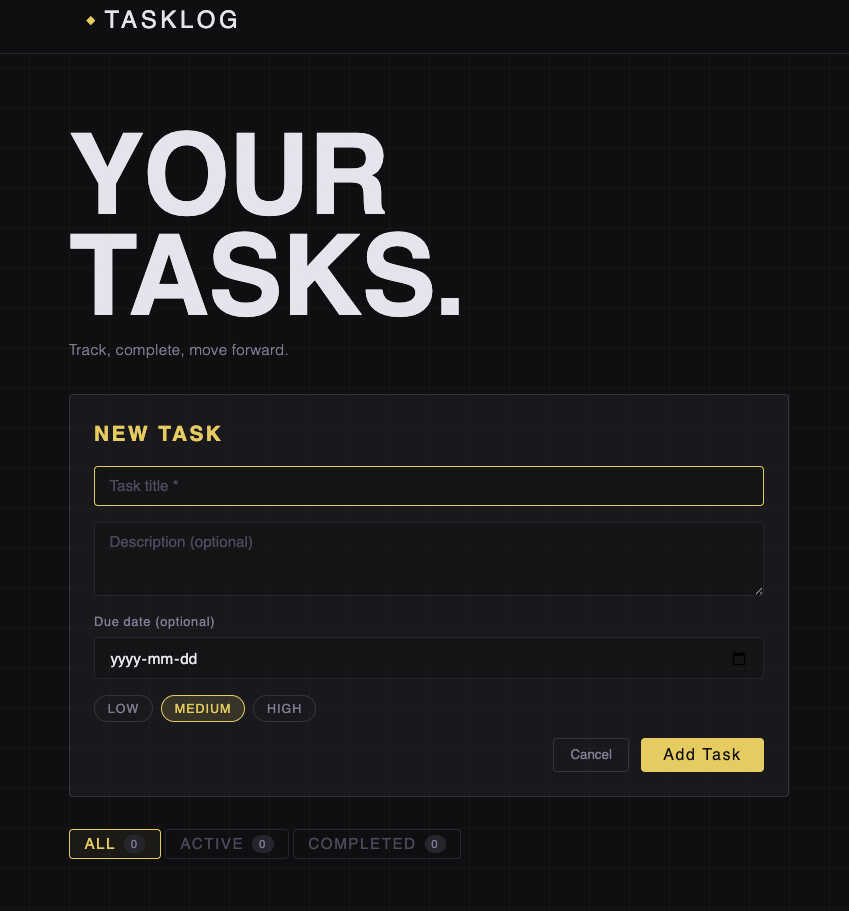
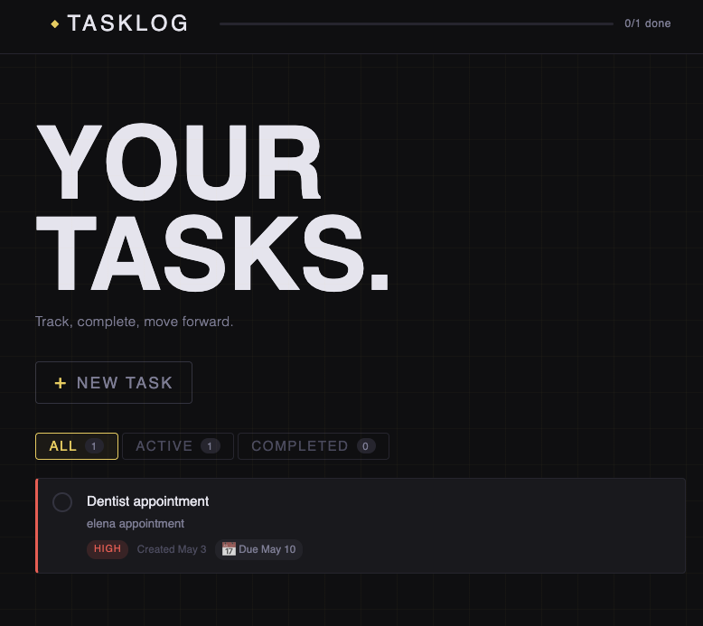
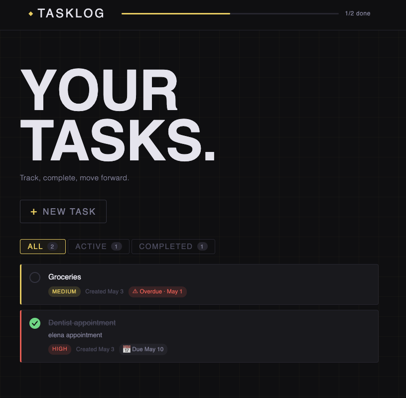

# ◆ Task Logger

A full-stack task management app built with **React + Vite** on the frontend and **Firebase Firestore** as the backend. Tasks are stored in the cloud in real time — no local server needed.



---

## Features

- Add tasks with title, description, priority level and optional due date
- Complete tasks with a single click — progress bar updates in real time
- Delete tasks with an animated exit
- Filter tasks by **All**, **Active**, or **Completed**
- Due date tracking with color-coded status:
  - 📅 **Upcoming** — neutral
  - ⏰ **Due today** — yellow
  - ⚠ **Overdue** — red
- Live sync with Firebase Firestore — data persists across sessions and devices

---

## Screenshots

### Task List


### Add Task Form


### Overdue and Completed States


---

## Tech Stack

| Layer    | Tech                          |
|----------|-------------------------------|
| Frontend | React 18 + Vite 5             |
| Backend  | Firebase Firestore (NoSQL)    |
| Fonts    | Bebas Neue + DM Sans          |

---

## Project Structure

```
frontend/
└── src/
    ├── api/
    │   └── tasks.js          # All Firestore CRUD functions
    ├── components/
    │   ├── AddTaskForm.jsx   # Form to create new tasks
    │   ├── TaskCard.jsx      # Individual task card component
    │   └── TaskList.jsx      # Task list with filter tabs
    ├── hooks/
    │   └── useTasks.js       # Custom hook — manages all task state
    ├── App.jsx               # Root component
    ├── App.css               # All styles
    ├── firebase.js           # Firebase initialization
    └── main.jsx              # Entry point
```

---

## Getting Started

### 1. Clone the repo

```bash
git clone https://github.com/jeanvq/ReactApp3.git
cd ReactApp3/frontend
```

### 2. Install dependencies

```bash
npm install
```

### 3. Set up Firebase

1. Go to [https://console.firebase.google.com](https://console.firebase.google.com)
2. Create a new project
3. Add a **Web App** and copy the `firebaseConfig`
4. Enable Firestore: **Build → Firestore Database → Create database → Test mode**

### 4. Add your Firebase config

Open `src/firebase.js` and replace the placeholder values:

```js
const firebaseConfig = {
  apiKey:            "YOUR_API_KEY",
  authDomain:        "YOUR_PROJECT.firebaseapp.com",
  projectId:         "YOUR_PROJECT_ID",
  storageBucket:     "YOUR_PROJECT.appspot.com",
  messagingSenderId: "YOUR_SENDER_ID",
  appId:             "YOUR_APP_ID",
}
```

### 5. Run the app

```bash
npm run dev
```

Open [http://localhost:5173](http://localhost:5173)

---

## Firestore Data Model

**Collection:** `tasks`

| Field        | Type              | Description                            |
|--------------|-------------------|----------------------------------------|
| `title`      | string            | Task title (required)                  |
| `description`| string            | Optional description                   |
| `priority`   | low / medium / high | Priority level                       |
| `completed`  | boolean           | Whether the task is done               |
| `due_date`   | string / null     | Optional deadline (YYYY-MM-DD)         |
| `created_at` | timestamp         | Auto-set by Firebase on creation       |

---

## How It Works

- On load, `useTasks.js` fetches all tasks from Firestore ordered by newest first
- When a task is added, it's saved to Firestore and prepended to the local list immediately
- Toggling a task uses **optimistic updates** — the UI updates instantly while Firestore syncs in the background
- Due dates are compared against today's date client-side to determine the color status

---

## Author

**Jeancarlo** — Web Development Student @ triOS College  
[jeancarlodev.com](https://jeancarlodev.com) · [GitHub](https://github.com/jeanvq)
